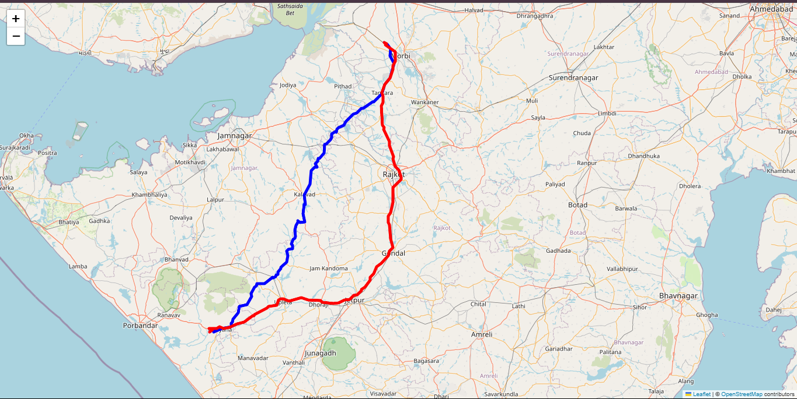

# Map-Visual-Path

## Overview

**Map-Visual-Path** is a Python-based project that visualizes the shortest path between points on a map using Dijkstra's algorithm. The project is designed to help users understand pathfinding algorithms and visualize their applications in real-world scenarios like navigation systems.

---

## Features

- **Graph Representation**: Nodes and edges are used to represent locations and connections.
- **Pathfinding Algorithm**: Implements Dijkstra's algorithm to calculate the shortest path between two points.
- **Interactive Visualization**: Outputs the map with the shortest path highlighted using `folium`.
- **Tom Tom api**: For real time routing.
- **Random Node Generation**: Generates random nodes within a specified latitude and longitude range.
- **HTML Output**: Generates dynamic maps to visualize results.

---

## Algorithm Used: **Dijkstra's Algorithm**

Dijkstra's algorithm finds the shortest path between nodes in a graph. Here's how it works:

1. Start at the source node, assigning it a tentative distance of 0 and all other nodes a tentative distance of infinity.
2. Visit the unvisited node with the smallest tentative distance.
3. Update the distances of its neighboring nodes.
4. Mark the visited node as "processed."
5. Repeat steps 2–4 until all nodes are processed or the destination is reached.

### Real-World Use Cases

- Navigation systems (e.g., Google Maps, Waze)
- Network routing
- Robotics path planning

---


### Prerequisites

Ensure you have Python 3.7 or higher installed. You'll also need the following libraries:

- `networkx`
- `folium`
- `matplotlib`
- `Flask`


## Usage

### Command Line Interface (CLI)

To use the CLI, navigate to the project directory and run the following command:
```bash
python DijikstraPython.py
```

The CLI will prompt you to enter the source and destination coordinates. After entering the coordinates, the program will calculate the shortest path and display the map with the highlighted path.

### Python Script

To use the Python script directly, you can modify the `DijikstraPython.py` file to specify the source and destination coordinates. Then, run the script:
```bash
python DijikstraPython.py
```

### HTML Output

The script generates an HTML file named `RouteMap.html` in the project directory. Open this file in a web browser to visualize the map with the shortest path highlighted.
In the output there are two colors one is Red which is longest path and Blue for shortest path.

The details will be saved in .json file named `RouteInfo.json` in the project directory.

---
### Output
The output will be a map with the shortest path between the source and destination coordinates highlighted. The map will be saved as `OutputMap.html` in the project directory.

### 1. Shortest path Highlighted

> *The map showing the shortest path between two nodes.*

